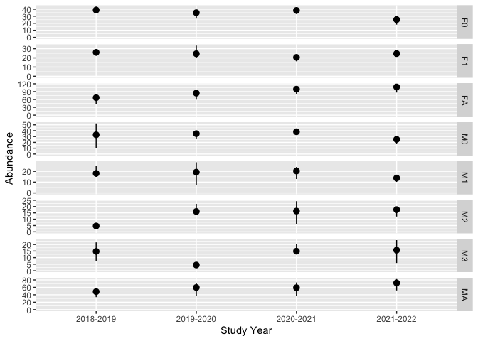

# bisonpictools

<!-- badges: start -->

[](https://lifecycle.r-lib.org/articles/stages.html#experimental)
[](https://github.com/poissonconsulting/bisonpictools/actions/workflows/R-CMD-check.yaml)
[](https://codecov.io/gh/poissonconsulting/bisonpictools)
<!-- badges: end -->

The goal of bisonpictools is to facilitate the visualization and
analysis of camera trap data from the Ronald Wood Bison herd.

## Installation

``` r
# install.packages("remotes")
remotes::install_github("poissonconsulting/bisonpictools")
```

## Data Visualization

The ratio plotted by `bpt_plot_ratios` is
`numerator:(denominator:numerator)`.

For example, the adult cow:(bull + cow) ratio plotted over all years and
locations:

``` r
library(bisonpictools)
```

    ## Loading required namespace: V8

``` r
bpt_plot_ratios(
  bpt_event_data,
  bpt_location_data,
  numerator = "fa",
  denominator = "ma"
)
```

<!-- -->

It is also possible to subset the data to include one or more camera
trap locations and/or study years:

``` r
bpt_plot_ratios(
  bpt_event_data,
  bpt_location_data,
  numerator = "fa",
  denominator = "ma",
  study_years = "2019-2020",
  locations = c("LOCID1", "LOCID2")
)
```

<!-- -->

Several age/sex classes can be combined to plot ratios of interest. For
example, this plots the calf:(cow + calf) ratio:

``` r
bpt_plot_ratios(
  bpt_event_data,
  bpt_location_data,
  numerator = c("f0", "m0", "u0"),
  denominator = c("fa")
)
```

<!-- -->

## Data Analysis

Launch the local data analysis app

``` r
# Launch app
```

Install Stan

``` r
# Install correct version of Stan
install.packages("rstan")
```

Read in data saved from the hosted app

``` r
# Change this directory to the folder where you have saved the data
dir <- "myfilepath"
event_data <- readr::read_csv(file.path(dir, "event_data.csv"))
location_data <- readr::read_csv(file.path(dir, "location_data.csv"))
```

# Put this in the vignette

Run the analysis:

- `nthin` controls the thinning of the MCMC samples;

  - `nthin = 1L` saves all samples
  - increase `nthin` if model is not converging

- `event_data` is the camera trap event data frame saved from the first
  app

- `location_data` is the location data frame saved from the first app

- `census` is the number of bison in the herd from census counts

- `census_cv` is the coefficient of variation of the census counts
  (standard deviation / estimate)

- `census_study_year` is the study year of the census counts (study year
  starts on Apr. 1)

- `census_day_of_year` is the day of the year of the census counts
  (first day of year is Apr. 1).

  - E.g. if the census was on the last day of March in 2023,
  - `census_study_year` = “2022-2023”
  - `census_day_of_year` = 365L

- `proportion_calf` is the proportion of calves in the herd

- `proportion_calf_cv` is the coefficient of variation of the proportion
  of calves in the herd

- `proportion_calf_study_year` is the study year of the proportion of
  calves in the herd (study year starts on Apr. 1)

- `proportion_calf_day_of_year` is the day of the year of the proportion
  of calves in the herd (first day of year is Apr. 1).

  - E.g. if the proportion of calves was estimated on the last day of
    March in 2022,
  - `proportion_calf_study_year` = “2021-2022”
  - `proportion_calf_day_of_year` = 365L

``` r
analysis <- bpt_analyse(
  event_data = bpt_event_data,
  location_data = bpt_location_data,
  census = 272L,
  census_cv = 20 / 272L,
  census_study_year = "2020-2021",
  census_day_of_year = 365L,
  proportion_calf = c(0.195, 0.151),
  proportion_calf_cv = c(0.5, 0.5),
  proportion_calf_study_year = c("2020-2021", "2021-2022"),
  proportion_calf_day_of_year = c(365L, 365L),
  nthin = 1L,
  analysis_mode = "quick"
)
```

``` r
# Save analysis object
bpt_save_analysis(analysis, file = "analysis")
# Load one too
```

## Plot predictions

``` r
# Plot predicted abundances by class
bpt_plot_predictions(analysis, prediction = "abundance-class")
```

<!-- -->

``` r
# Plot total abundance
bpt_plot_predictions(analysis, prediction = "abundance-total")
```

<!-- -->

``` r
# Plot survival rates
bpt_plot_predictions(analysis, prediction = "survival")
```

<!-- -->

``` r
# Plot fecundity rates
bpt_plot_predictions(analysis, prediction = "fecundity")
```

<!-- -->

``` r
# Plot ratios
bpt_plot_predictions(analysis, prediction = "ratios")
```

<!-- -->
