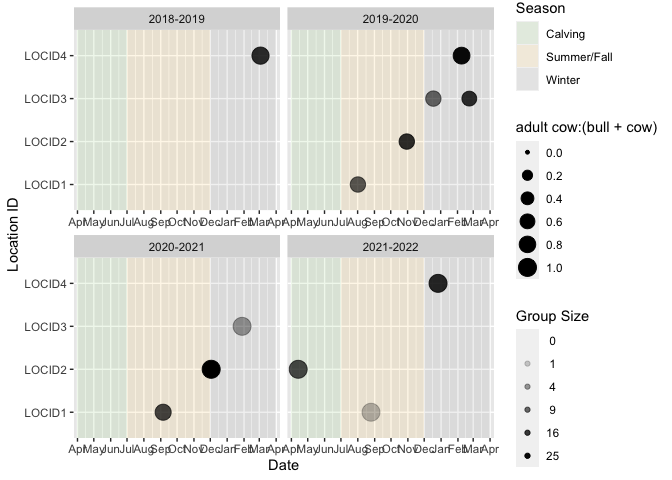
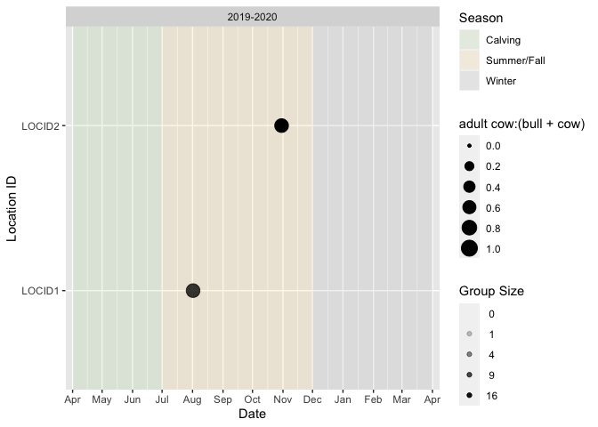
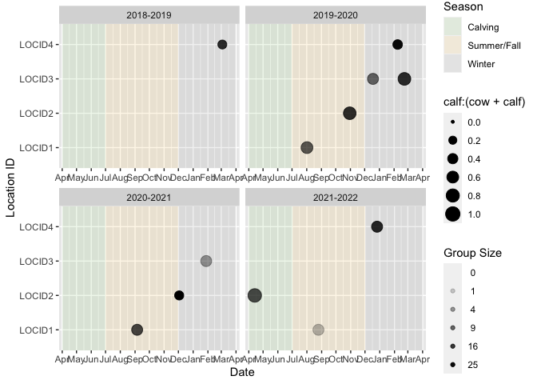
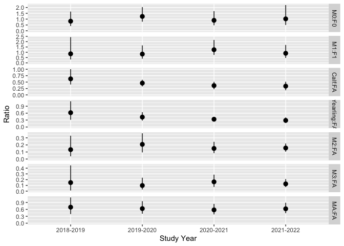
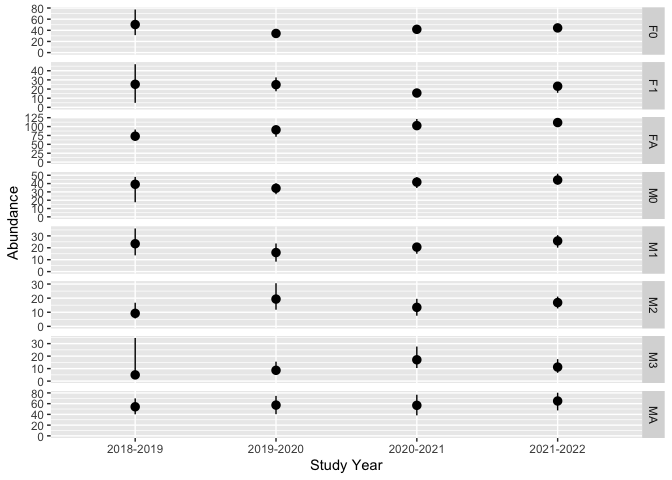
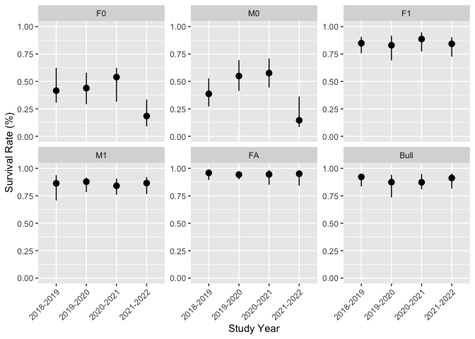
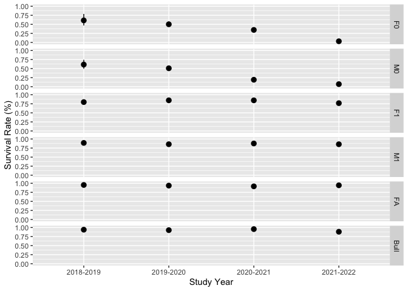
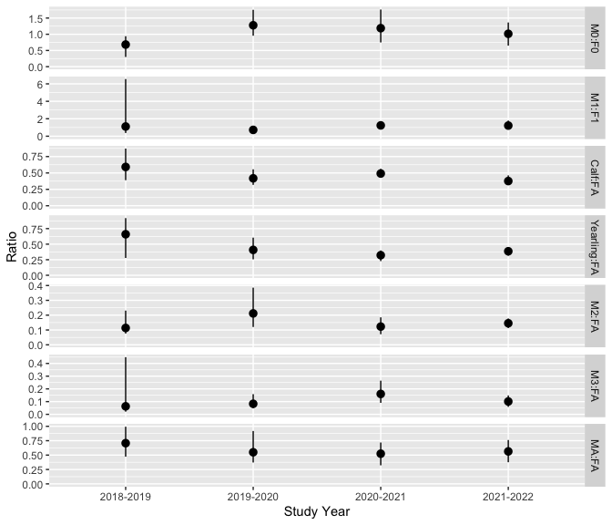

# bisonpictools

<!-- badges: start -->

[](https://lifecycle.r-lib.org/articles/stages.html#experimental)
[](https://github.com/poissonconsulting/bisonpictools/actions/workflows/R-CMD-check.yaml)
[](https://codecov.io/gh/poissonconsulting/bisonpictools)
<!-- badges: end -->

The goal of bisonpictools is to facilitate the visualization and
analysis of camera trap data from the Ronald Wood Bison herd.

## Installation

``` r
# install.packages("remotes")
remotes::install_github("poissonconsulting/bisonpictools")
```

## Data Visualization

The ratio plotted by `bpt_plot_ratios` is
`numerator:(denominator:numerator)`.

For example, the adult cow:(bull + cow) ratio plotted over all years and
locations:

``` r
library(bisonpictools)
bpt_plot_ratios(
  bpt_event_data,
  bpt_location_data,
  numerator = "fa",
  denominator = "ma"
)
```

<!-- -->

It is also possible to subset the data to include one or more camera
trap locations and/or study years:

``` r
bpt_plot_ratios(
  bpt_event_data,
  bpt_location_data,
  numerator = "fa",
  denominator = "ma",
  study_years = "2019-2020",
  locations = c("LOCID1", "LOCID2")
)
```

<!-- -->

Several age/sex classes can be combined to plot ratios of interest. For
example, this plots the calf:(cow + calf) ratio:

``` r
bpt_plot_ratios(
  bpt_event_data,
  bpt_location_data,
  numerator = c("f0", "m0", "u0"),
  denominator = c("fa")
)
```

<!-- -->

## Data Analysis

Launch the local data analysis app

``` r
# Launch app
```

Install Stan

``` r
# Install correct version of Stan
install.packages("rstan")
```

Run the analysis. The following example uses the built-in example data.

``` r
analysis <- bpt_analyse(
  event_data = bpt_event_data,
  location_data = bpt_location_data,
  census_data = bpt_census_data,
  proportion_calf_data = bpt_proportion_calf_data,
  nthin = 1L,
  analysis_mode = "quick"
)
```

Save the analysis object

``` r
# Save analysis object
bpt_save_analysis(analysis, file = "file_path/analysis")
```

Make predictions

``` r
# Predict total abundance
bpt_predict_abundance_total(analysis)
```

    ## # A tibble: 4 × 4
    ##   annual    estimate lower upper
    ##   <fct>        <dbl> <dbl> <dbl>
    ## 1 2018-2019     243.  213.  280.
    ## 2 2019-2020     249.  226.  273.
    ## 3 2020-2021     268.  253.  291.
    ## 4 2021-2022     295.  283.  312.

``` r
# Can predict other values using the following functions
bpt_predict_abundance_class(analysis) # Predicts abundance by class
bpt_predict_survival(analysis) # Predicts survival rates
bpt_predict_fecundity(analysis) # Predicts fecundity rate and proportion of reproductive cows
bpt_predict_ratios(analysis) # Predicts population ratios
```

## Plot Predictions

``` r
# Load analysis object
bpt_load_analysis("file_path/analysis")
```

``` r
# Plot predicted abundances by class
bpt_plot_predictions(analysis, prediction = "abundance-class")
```

<!-- -->

``` r
# Plot total abundance
bpt_plot_predictions(analysis, prediction = "abundance-total")
```

<!-- -->

``` r
# Plot survival rates
bpt_plot_predictions(analysis, prediction = "survival")
```

<!-- -->

``` r
# Plot fecundity rates
bpt_plot_predictions(analysis, prediction = "fecundity")
```

<!-- -->

``` r
# Plot ratios
bpt_plot_predictions(analysis, prediction = "ratios")
```

<!-- -->
