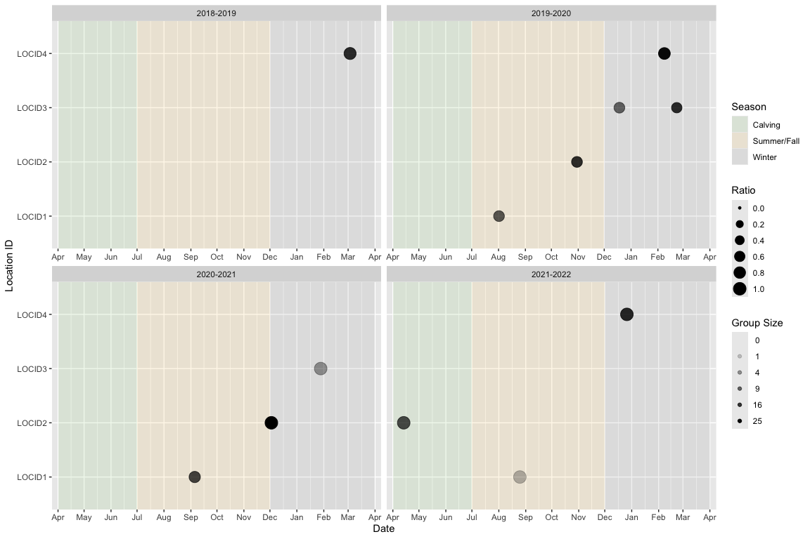

# bisonpictools

<!-- badges: start -->

[](https://lifecycle.r-lib.org/articles/stages.html#experimental)
[](https://github.com/poissonconsulting/bisonpictools/actions/workflows/R-CMD-check.yaml)
[](https://codecov.io/gh/poissonconsulting/bisonpictools)
<!-- badges: end -->

The goal of `bisonpictools` is to facilitate the visualization and
analysis of camera trap data for wood bison herds. The package includes
functions to check the correct formatting of data, visualize the data,
manipulate and analyse the data using a complex custom-built Bayesian
model, and generate predictions of abundances, survival and fecundity
rates, and population ratios.

## bisonpic Suite

`bisonpictools` is one of three packages in the **bisonpic** suite of
tools:

- [`bisonpictools`](https://github.com/poissonconsulting/bisonpictools)
- [`shinybisonpic`](https://github.com/poissonconsulting/shinybisonpic)
- [`runbisonpic`](https://github.com/poissonconsulting/runbisonpic)

`bisonpictools` provides the underlying visualization and analysis
functionality; `shinybisonpic` is a web-based Shiny app that provides a
Graphical User Interface to facilitate data visualization and
exploration, and `runbisonpic` is a local-based Shiny app to set up and
run an analysis.

## Installation

To install the latest development version of `bisonpictools`:

``` r
install.packages("remotes")
remotes::install_github("poissonconsulting/bisonpictools")
```

And to load the package into the current R session:

``` r
library(bisonpictools)
```

## Data

`bisonpictools` accepts data in a specific format for wood bison camera
trap locations and events, as well as census and proportion of calf
estimates from aerial surveys of the herd. There is a downloadable excel
template in each of the Shiny apps that aids the user to populate their
data appropriately.

``` r
# Example data for locations of camera traps
location_data
```

    ## # A tibble: 4 × 3
    ##   location_id latitude longitude
    ##   <chr>          <dbl>     <dbl>
    ## 1 LOCID1          58.0     -112.
    ## 2 LOCID2          58.0     -112.
    ## 3 LOCID3          58.0     -112.
    ## 4 LOCID4          58.0     -112.

``` r
# Example data for camera trap events
event_data
```

    ## # A tibble: 12 × 20
    ##    location_id start_year start_month start_day start_hour start_minute    fa
    ##    <chr>            <dbl>       <dbl>     <dbl>      <dbl>        <dbl> <dbl>
    ##  1 LOCID1            2019           8         1         12           50     2
    ##  2 LOCID1            2020           9         5          9           30     3
    ##  3 LOCID1            2021           8        25          6           11     1
    ##  4 LOCID2            2019          10        30         13           19     2
    ##  5 LOCID2            2020          12         2         15           27    10
    ##  6 LOCID2            2021           4        13         11           48     1
    ##  7 LOCID3            2019          12        18         12           51     2
    ##  8 LOCID3            2020           2        22         18            6     3
    ##  9 LOCID3            2021           1        28         10           17     1
    ## 10 LOCID4            2019           3         3          5           59     8
    ## 11 LOCID4            2020           2         8         11           41    10
    ## 12 LOCID4            2021          12        26         10           20     5
    ## # ℹ 13 more variables: f1 <dbl>, f0 <dbl>, fu <dbl>, ma <dbl>, m3 <dbl>,
    ## #   m2 <dbl>, m1 <dbl>, m0 <dbl>, mu <dbl>, ua <dbl>, u1 <dbl>, u0 <dbl>,
    ## #   uu <dbl>

``` r
# Example data for census estimate from aerial surveys
census_data
```

    ## # A tibble: 2 × 5
    ##   census_year census_month census_day census census_cv
    ##         <dbl>        <dbl>      <dbl>  <dbl>     <dbl>
    ## 1        2021            3         31    250      0.05
    ## 2        2022            3         31    275      0.06

``` r
# Example data for proportion of calves estimate from aerial surveys
proportion_calf_data
```

    ## # A tibble: 2 × 5
    ##   proportion_calf_year proportion_calf_month proportion_calf_day proportion_calf
    ##                  <dbl>                 <dbl>               <dbl>           <dbl>
    ## 1                 2021                     3                  31            0.2 
    ## 2                 2022                     3                  31            0.15
    ## # ℹ 1 more variable: proportion_calf_cv <dbl>

## Data Visualization

Use the `bpt_plot_ratios()` function to visualize ratios in the
classified counts from the camera trap events over time. The ratio
plotted is `numerator:(denominator + numerator)` to avoid infinite
values.

For example, the adult cow:(bull + cow) ratio plotted over all years and
locations:

``` r
library(bisonpictools)
bpt_plot_ratios(
  event_data,
  location_data,
  numerator = "fa",
  denominator = "ma"
)
```

<!-- -->

## Data Analysis

The `bpt_analyse()` function runs the analysis. The following example
uses the built-in example data in the demonstrative “quick” analysis
mode.

``` r
analysis <- bpt_analyse(
  event_data = event_data,
  location_data = location_data,
  census_data = census_data,
  proportion_calf_data = proportion_calf_data,
  nthin = 1L,
  analysis_mode = "quick"
)
```

## View model estimates

Use the `bpt_coefficient_table()` function to view the model estimates.

``` r
bpt_coefficient_table(analysis)
```

    ## # A tibble: 57 × 5
    ##    term                           estimate    lower  upper svalue
    ##    <term>                            <dbl>    <dbl>  <dbl>  <dbl>
    ##  1 bEtaSummerFall                    0.232  0.00955  0.753  4.39 
    ##  2 bEtaWin                           0.101  0.00114  0.484  4.39 
    ##  3 bFecundityReproductiveFA          1.94   1.63     2.69   4.39 
    ##  4 bInitialMortalityCalfAnnual[1]   -3.75  -5.78    -2.12   4.39 
    ##  5 bInitialMortalityCalfAnnual[2]   -4.56  -7.45    -2.35   4.39 
    ##  6 bInitialMortalityCalfAnnual[3]   -2.87  -7.46    -1.60   4.39 
    ##  7 bInitialMortalityCalfAnnual[4]   -1.09  -6.11     3.64   0.485
    ##  8 bKmWeekSummerFall                 2.22   0.266    4.42   4.39 
    ##  9 bKmWeekWin                        1.93   1.21     2.63   4.39 
    ## 10 bMAProportion[1]                  0.440  0.258    0.582  4.39 
    ## # ℹ 47 more rows

## Make predictions

Predictions of the total and the class-wise abundances, the fecundity
and survival rates, and several ratios of interest are derived from the
posterior distribution of the estimated parameters. These can be
visualized in tables using the functions with the `bpt_predict` prefix:

``` r
# E.g., Predict total abundance
bpt_predict_abundance_total(analysis)
```

    ## # A tibble: 4 × 4
    ##   annual    estimate lower upper
    ##   <fct>        <dbl> <dbl> <dbl>
    ## 1 2018-2019     211.  182.  244.
    ## 2 2019-2020     225.  205.  252.
    ## 3 2020-2021     254.  230.  280.
    ## 4 2021-2022     295.  258.  311.

``` r
# Can predict other values using the following functions
bpt_predict_abundance_class(analysis) # Predicts abundance by class
bpt_predict_survival(analysis) # Predicts survival rates
bpt_predict_fecundity(analysis) # Predicts fecundity rate and proportion of reproductive cows
bpt_predict_ratios(analysis) # Predicts population ratios
```

Each of the above predictions can be plotted in a figure using the
`bpt_plot_predictions()` function.

``` r
# E.g., Plot predicted abundances by class
bpt_plot_predictions(analysis, prediction = "abundance-class")
```

<!-- -->

The other predictions can be plotted by executing the following code:

``` r
# Plot total abundance
bpt_plot_predictions(analysis, prediction = "abundance-total")
# Plot survival rates
bpt_plot_predictions(analysis, prediction = "survival")
# Plot fecundity rates
bpt_plot_predictions(analysis, prediction = "fecundity")
# Plot ratios
bpt_plot_predictions(analysis, prediction = "ratios")
```

## Information

Additional information is available from the
[`bisonpicsuite`](https://poissonconsulting.github.io/bisonpicsuite/)
and
[`bisonpictools`](https://poissonconsulting.github.io/bisonpictools/)
websites, which contain the following articles:

- `bisonpicsuite`
  - [“Getting Started with
    bisonpicsuite”](https://poissonconsulting.github.io/bisonpicsuite/bisonpicsuite-getting-started.html)
  - [“Bisonpic User
    Guide”](https://poissonconsulting.github.io/bisonpicsuite/bisonpic-user-guide.html)
- `bisonpictools`
  - [“Getting Started with
    bisonpictools”](https://poissonconsulting.github.io/bisonpictools/bisonpictools-getting-started.html)
  - [“Analytical
    Methods”](https://poissonconsulting.github.io/bisonpictools/bisonpic-methods.html)

## Contribution

Please report any
[issues](https://github.com/poissonconsulting/bisonpictools/issues).

## Code of Conduct

Please note that the `bisonpictools` project is released with a
[Contributor Code of
Conduct](https://www.contributor-covenant.org/version/2/1/code_of_conduct/).
By contributing to this project, you agree to abide by its terms.

## Licensing

Copyright 2023 Province of Alberta

Licensed under the Apache License, Version 2.0 (the “License”); you may
not use this file except in compliance with the License. You may obtain
a copy of the License at

<http://www.apache.org/licenses/LICENSE-2.0>

Unless required by applicable law or agreed to in writing, software
distributed under the License is distributed on an “AS IS” BASIS,
WITHOUT WARRANTIES OR CONDITIONS OF ANY KIND, either express or implied.
See the License for the specific language governing permissions and
limitations under the License.
