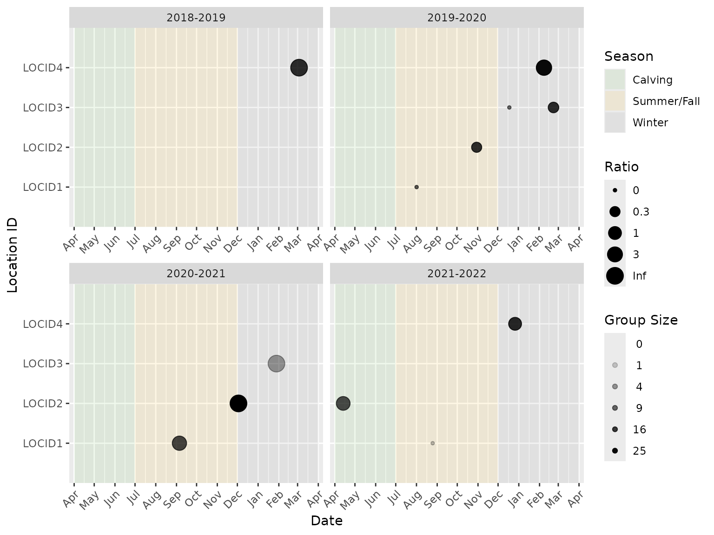
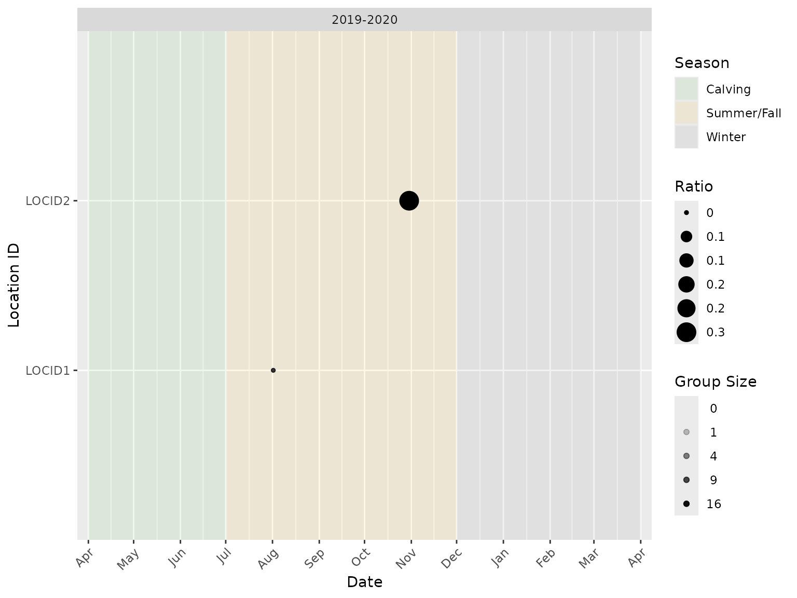
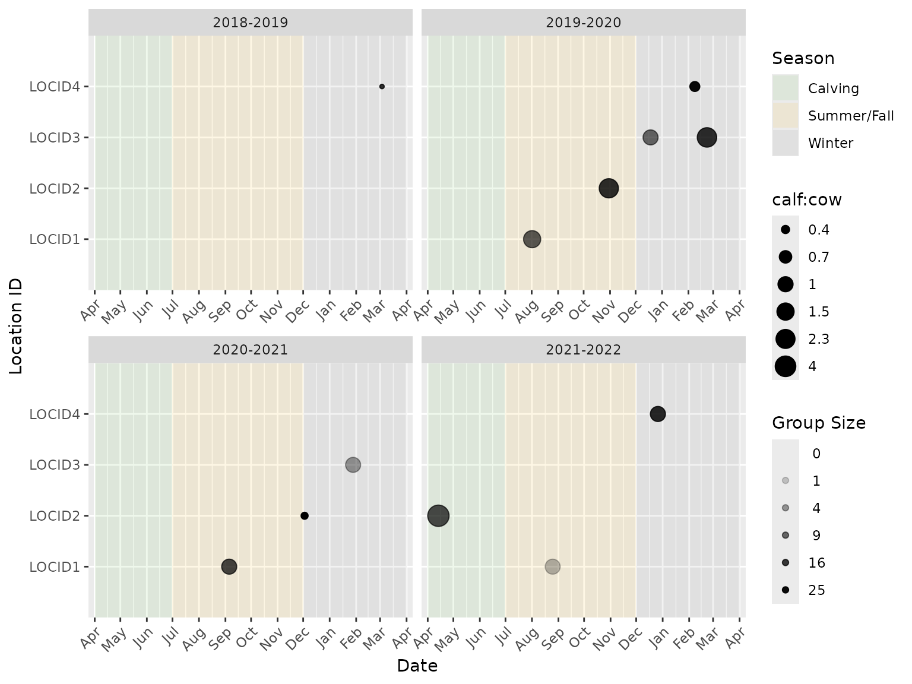
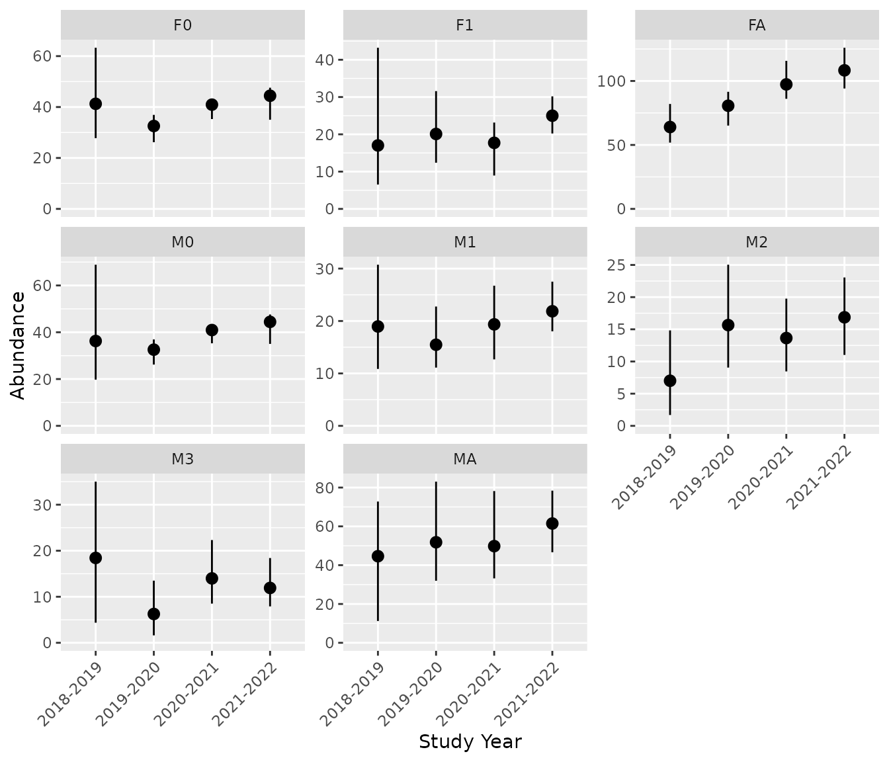
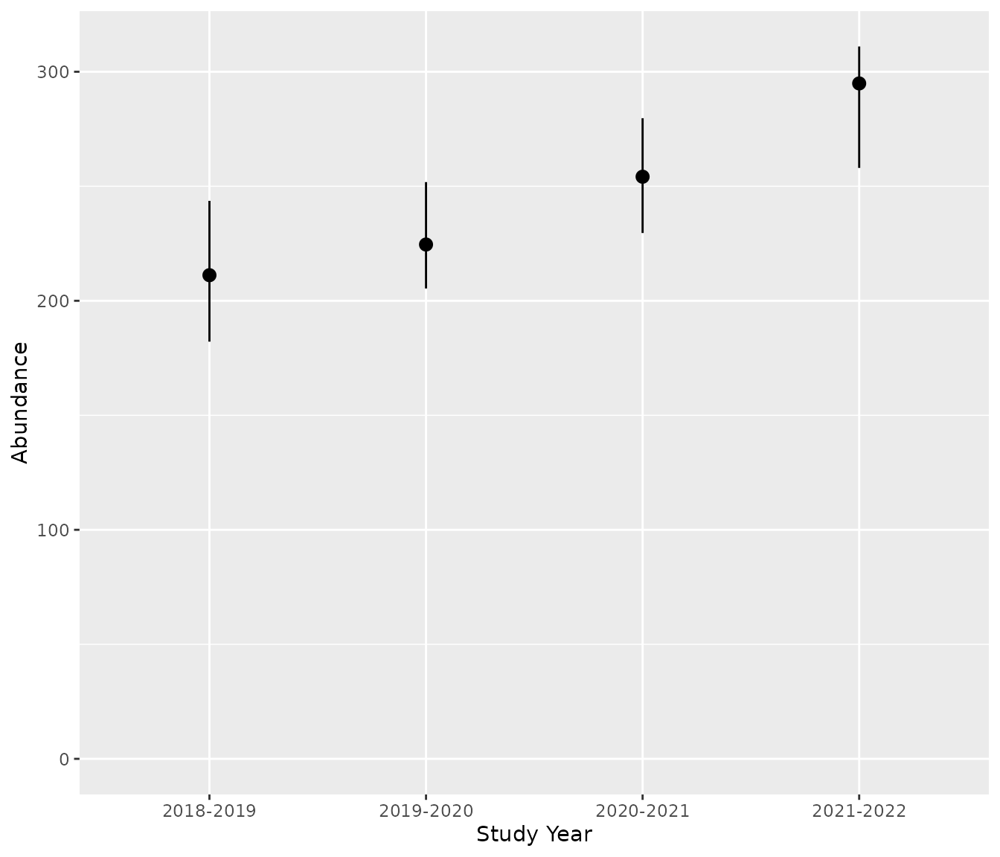
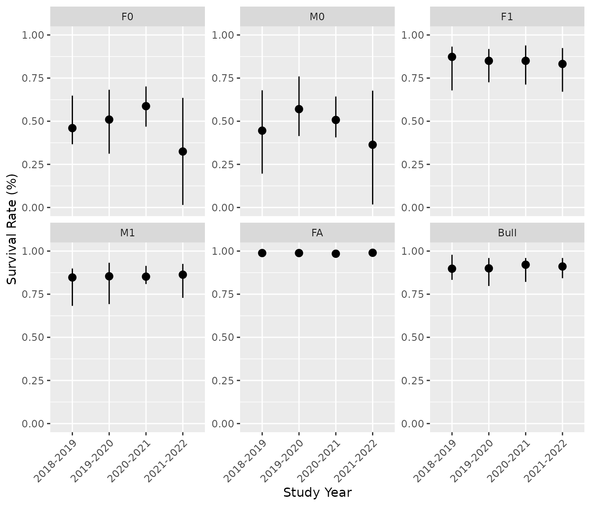
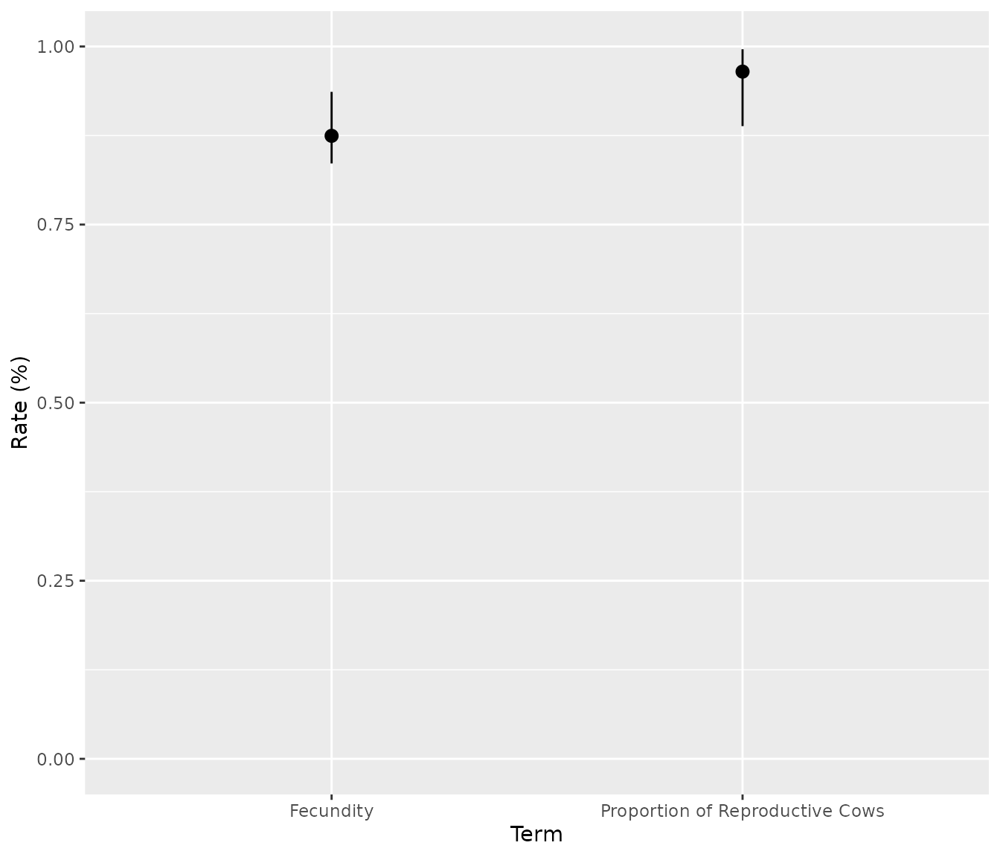
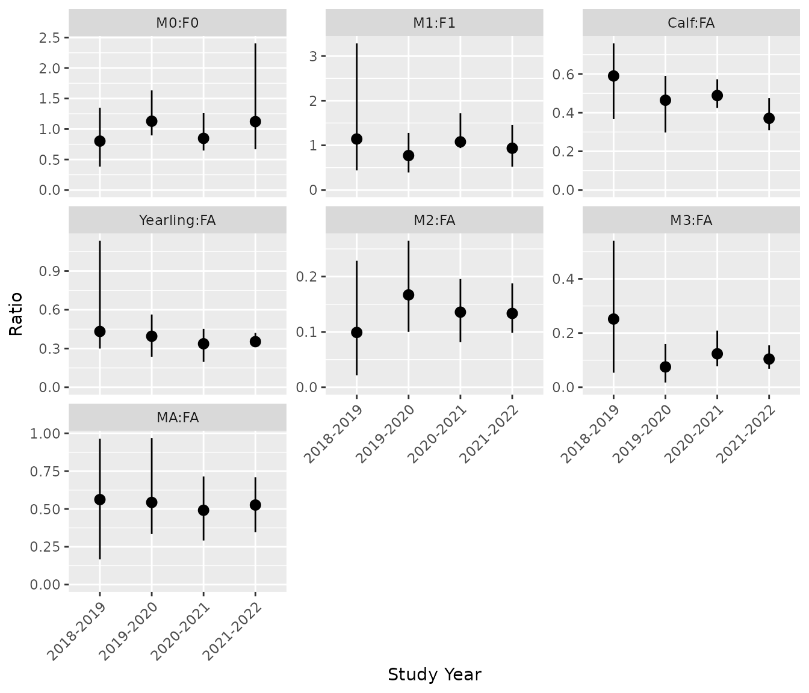

# Getting Started with bisonpictools

    #> Registered S3 method overwritten by 'mcmcr':
    #>   method         from 
    #>   as.mcmc.nlists nlist

`bisonpictools` is an R package to facilitate the visualization and
analysis of camera trap data for wood bison herds. The package includes
functions to check the correct formatting of data, visualize the data,
manipulate and analyse the data using a complex custom-built Bayesian
model, and generate and plot predictions of abundances, survival and
fecundity rates, and population ratios.

## Installation

To install the latest development version of `bisonpictools`, execute
the following code in the RStudio console.

``` r

install.packages("remotes")
remotes::install_github("poissonconsulting/bisonpictools")
```

## bisonpic Suite

`bisonpictools` is part of the bisonpic suite of tools. Other packages
in this suite include:

- [shinybisonpic](https://github.com/poissonconsulting/shinybisonpic)
- [runbisonpic](https://github.com/poissonconsulting/runbisonpic)

## Getting Help

To get additional information on a particular function just type `?`
followed by the name of the function in the R console. For example,
`?bpt_analyse()` brings up the R documentation for the `bisonpictools`
analysis function.

For more information on using R the reader is referred to [R for Data
Science](https://r4ds.had.co.nz/) (Wickham and Grolemund 2016).

If you discover a bug in `bisonpictools` please file an
[issue](https://github.com/poissonconsulting/bisonpictools/issues) with
a [reprex](https://reprex.tidyverse.org/) (reproducible example).

## Data

The easiest way to prepare the data for use with the `bisonpictools`
functions is to download the templated excel spreadsheet from the
[shinybisonpic
website](https://poissonconsulting.shinyapps.io/shinybisonpic/). Click
the **Download Template** button, and populate each sheet with your
data.

- `event_data` contains the camera trap event data, including the date
  and time of each event, location of the camera trap, and the number of
  individuals in each class
- `location_data` contains the coordinates of the camera traps
- `census_data` contains population estimates of the population from
  aerial surveys, and the date of the surveys
  - specifically, this should be an estimate of the entire population
    size, not a minimum count
- `proportion_calf_data` contains estimates of the proportion of calves
  in the population from aerial surveys, and the date of the surveys

## Data Visualization

### Using the RStudio Console

Functions from `bisonpictools` can be run in the RStudio console. The
[`bpt_plot_ratios()`](https://poissonconsulting.github.io/bisonpictools/reference/bpt_plot_ratios.md)
function plots the ratios of various sex-age classes over time. The user
needs to provide the event and location data, as well as vectors of
classes to form the numerator and denominator of the ratio.

#### (1) Read in data from the populated excel template

``` r

# Change `dir` to the file path of the populated excel template on your computer
dir <- "myfilepath.xlsx"
# Install readxl to read the excel spreadsheet into R
remotes::install_github("readxl")
# Read each sheet into R
location_data <- readxl::read_xlsx(dir, sheet = "location")
event_data <- readxl::read_xlsx(dir, sheet = "event")
census_data <- readxl::read_xlsx(dir, sheet = "census")
proportion_calf_data <- readxl::read_xlsx(dir, sheet = "proportion_calf")
```

#### (2) Produce ratio plots

Data checks are completed before the analysis is run to ensure they are
in the correct format. In the plot, each point represents an event. The
size (area) of the point indicates the ratio while the opacity of the
point indicates the number of individuals in the group.

Note that a ratio value of “Inf” (infinity) indicates that the group in
a particular camera trap event has no individuals in the denominator
class. For example, if plotting the calf:cow ratio, a ratio value of
“Inf” would represent an event with one or more calves and no cows.
Similarly, a ratio of “0” indicates that the ratio in a particular
camera trap event has no individuals in the numerator class. For the
calf:cow ratio example, this would represent an event with one or more
cows and no calves.

For example, the female calf:male calf ratio plotted over all years and
locations from example data:

``` r

library(bisonpictools)
bpt_plot_ratios(
  event_data,
  location_data,
  numerator = "f0",
  denominator = "m0"
)
#> Warning in ggplot2::guide_legend(show.limits = TRUE, order = 2): Arguments in `...` must be used.
#> ✖ Problematic argument:
#> • show.limits = TRUE
#> ℹ Did you misspell an argument name?
#> Warning in ggplot2::guide_legend(show.limits = TRUE, order = 3): Arguments in `...` must be used.
#> ✖ Problematic argument:
#> • show.limits = TRUE
#> ℹ Did you misspell an argument name?
```



It is also possible to subset the data to include one or more camera
trap locations and/or study years:

``` r

bpt_plot_ratios(
  event_data,
  location_data,
  numerator = "f0",
  denominator = "m0",
  study_years = "2019-2020",
  locations = c("LOCID1", "LOCID2")
)
#> Warning in ggplot2::guide_legend(show.limits = TRUE, order = 2): Arguments in `...` must be used.
#> ✖ Problematic argument:
#> • show.limits = TRUE
#> ℹ Did you misspell an argument name?
#> Warning in ggplot2::guide_legend(show.limits = TRUE, order = 3): Arguments in `...` must be used.
#> ✖ Problematic argument:
#> • show.limits = TRUE
#> ℹ Did you misspell an argument name?
```



Several age/sex classes can be combined to plot ratios of interest. For
example, the next code chunk plots the calf:(cow + calf) ratio.

The label for the ratio legend can be changed from the default
(“Ratio”), to more specific label, using the `ratio_name` argument.

``` r

bpt_plot_ratios(
  event_data,
  location_data,
  numerator = c("f0", "m0", "u0"),
  denominator = c("fa"),
  ratio_name = "calf:cow"
)
#> Warning in ggplot2::guide_legend(show.limits = TRUE, order = 2): Arguments in `...` must be used.
#> ✖ Problematic argument:
#> • show.limits = TRUE
#> ℹ Did you misspell an argument name?
#> Warning in ggplot2::guide_legend(show.limits = TRUE, order = 3): Arguments in `...` must be used.
#> ✖ Problematic argument:
#> • show.limits = TRUE
#> ℹ Did you misspell an argument name?
```



### `shinybisonpic`

The [`shinybisonpic` Shiny
app](https://poissonconsulting.shinyapps.io/shinybisonpic) can be used
to explore the locations of camera traps and the the ratios of different
classes of wood bison in camera trap observations in a user-friendly
manner. Refer to the [user
guide](https://poissonconsulting.github.io/bisonpicsuite/articles/bisonpic-user-guide.html)
for more information on how to use the `shinybisonpic` app.

## Data Analysis

### Using the RStudio Console

#### (1) Read in data from the populated excel template

``` r

# Change `dir` to the file path of the populated excel template on your computer
dir <- "myfilepath.xlsx"
# Install readxl to read the excel spreadsheet into R
remotes::install_github("readxl")
# Read each sheet into R
location_data <- readxl::read_xlsx(dir, sheet = "location")
event_data <- readxl::read_xlsx(dir, sheet = "event")
census_data <- readxl::read_xlsx(dir, sheet = "census")
proportion_calf_data <- readxl::read_xlsx(dir, sheet = "proportion_calf")
```

#### (2) Run the analysis

This uses the
[`bpt_analyse()`](https://poissonconsulting.github.io/bisonpictools/reference/bpt_analyse.md)
function. Data checks are completed before the analysis is run to ensure
they are in the correct format. Informative error messages will print to
the console if the data do not follow the required format. The following
arguments control the number of MCMC chains, number of iterations, and
the thinning rate of the model:

- `analysis_mode` controls the number of iterations and chains in the
  model run:
  - `"debug"` is used for printing out the errors if the model does not
    sample (10 iterations from 2 chains),
  - `"quick"` is used for running through a quick run of the model for
    demonstration purposes (10 iterations from 2 chains),
  - `"report"` is the default and is used for the full analysis (500
    iterations from 3 chains).
- `nthin` controls the thinning of the MCMC samples:
  - `nthin = 1L` saves every sample; use this for `"debug"` and
    `"quick"` modes,
  - `nthin = 10L` saves every 10^{th} sample, and is the detault; use
    this for `"report"` mode,
  - increase `nthin` by 5 if the model does not converge in “report”
    mode.

It is recommended to:

1.  Run the model in `analysis_mode = "quick"` mode with a thinning rate
    of `nthin = 1L` to ensure the model samples correctly.
2.  If there were no errors in step 1, proceed by running the model in
    `analysis_mode = "report"` with a thinning rate of `nthin = 10L`, to
    achieve convergence. Ensure the table output by the model has `TRUE`
    in the “converged” column. If the model did not converge, increase
    `nthin` by 5, and re-run the model.
3.  If there were errors in step 1, proceed instead by running the model
    in `analysis_mode = "debug"` with a thinning rate of `nthin = 1L` to
    print informative error messages.

``` r

# Start by running once on "quick" mode, with a thinning rate of 1
analysis <- bpt_analyse(
  event_data = event_data,
  location_data = location_data,
  census_data = census_data,
  proportion_calf_data = proportion_calf_data,
  nthin = 1L,
  analysis_mode = "quick"
)

# If no errors appear, run the model on "report" mode, with a thinning rate of 10
analysis <- bpt_analyse(
  event_data = event_data,
  location_data = location_data,
  census_data = census_data,
  proportion_calf_data = proportion_calf_data,
  nthin = 10L,
  analysis_mode = "report"
)

# If errors do appear, run the model on "debug" mode, which will provide
# informative error messages
analysis <- bpt_analyse(
  event_data = event_data,
  location_data = location_data,
  census_data = census_data,
  proportion_calf_data = proportion_calf_data,
  nthin = 1L,
  analysis_mode = "debug"
)
```

#### (3) Check that the model converged

In `"quick"` or `"debug"` mode, convergence is not expected. In
`"report"` mode, convergence is expected. See the `converged` column in
the table printed after
[`bpt_analyse()`](https://poissonconsulting.github.io/bisonpictools/reference/bpt_analyse.md)
is run to assess whether or not the analysis converged. If it says
`TRUE`, the model converged. If it says `FALSE`, the model did not
converge.

This is an example of a model run in “quick” mode that did not converge
(i.e., the “converged” column reads `FALSE`).

    #> # A tibble: 1 × 8
    #>       n     K nchains niters nthin   ess  rhat converged
    #>   <int> <int>   <int>  <int> <int> <int> <dbl> <lgl>    
    #> 1    11    57       2     10     1     7  1.97 FALSE

#### (4) Coefficient table

Use the
[`bpt_coefficient_table()`](https://poissonconsulting.github.io/bisonpictools/reference/bpt_coefficient_table.md)
function to print out the estimated parameters from the model run.

``` r

coef <- bpt_coefficient_table(analysis)
print(coef)
#> # A tibble: 57 × 5
#>    term                           estimate    lower  upper svalue
#>    <term>                            <dbl>    <dbl>  <dbl>  <dbl>
#>  1 bEtaSummerFall                    0.232  0.00955  0.753  4.39 
#>  2 bEtaWin                           0.101  0.00114  0.484  4.39 
#>  3 bFecundityReproductiveFA          1.94   1.63     2.69   4.39 
#>  4 bInitialMortalityCalfAnnual[1]   -3.75  -5.78    -2.12   4.39 
#>  5 bInitialMortalityCalfAnnual[2]   -4.56  -7.45    -2.35   4.39 
#>  6 bInitialMortalityCalfAnnual[3]   -2.87  -7.46    -1.60   4.39 
#>  7 bInitialMortalityCalfAnnual[4]   -1.09  -6.11     3.64   0.515
#>  8 bKmWeekSummerFall                 2.22   0.266    4.42   4.39 
#>  9 bKmWeekWin                        1.93   1.21     2.63   4.39 
#> 10 bMAProportion[1]                  0.440  0.258    0.582  4.39 
#> # ℹ 47 more rows
```

#### (5) Save the analysis object

Ensure that the analysis object is saved once the model finishes
running. The
[`bpt_save_analysis()`](https://poissonconsulting.github.io/bisonpictools/reference/bpt_save_analysis.md)
function saves the analysis to the desired file path.

``` r

# Save the analysis object.
# Change the file path to the desired directory (does not require a file extension)
bpt_save_analysis(analysis, file = "file_path/analysis")
```

To load the analysis object back into R, use the complimentary function,
[`bpt_load_analysis()`](https://poissonconsulting.github.io/bisonpictools/reference/bpt_load_analysis.md),
using the same file path it was saved to above.

``` r

# Load analysis object if not still in the environment, using the same file path
# it was saved to in step (4) above.
analysis <- bpt_load_analysis("file_path/analysis")
```

#### (6) Make predictions

Predictions of the stage-wise and total abundances, survival and
fecundity rates, and select ratios are derived from the posterior
distributions of the estimated parameters. Use the functions with the
`bpt_predict` prefix to generate the predictions.

``` r

# Predict total abundance
bpt_predict_abundance_total(analysis)
#> # A tibble: 4 × 4
#>   annual    estimate lower upper
#>   <fct>        <dbl> <dbl> <dbl>
#> 1 2018-2019     211.  182.  244.
#> 2 2019-2020     225.  205.  252.
#> 3 2020-2021     254.  230.  280.
#> 4 2021-2022     295.  258.  311.
```

``` r

# Predicts abundance by class:
bpt_predict_abundance_class(analysis)
#> # A tibble: 32 × 5
#>    annual    class estimate lower upper
#>    <fct>     <chr>    <dbl> <dbl> <dbl>
#>  1 2018-2019 F0        41.3 27.8   63.3
#>  2 2019-2020 F0        32.6 26.2   36.9
#>  3 2020-2021 F0        40.9 35.3   43.0
#>  4 2021-2022 F0        44.4 35.0   47.6
#>  5 2018-2019 F1        17.0  6.53  43.2
#>  6 2019-2020 F1        20.1 12.4   31.6
#>  7 2020-2021 F1        17.7  8.95  23.2
#>  8 2021-2022 F1        25.0 20.2   30.2
#>  9 2018-2019 FA        64.0 51.8   82.0
#> 10 2019-2020 FA        80.6 65.1   91.5
#> # ℹ 22 more rows
```

``` r

# Predicts survival rates by class:
bpt_predict_survival(analysis)
#> # A tibble: 24 × 5
#>    annual    class estimate  lower upper
#>    <fct>     <fct>    <dbl>  <dbl> <dbl>
#>  1 2018-2019 F0       0.460 0.366  0.648
#>  2 2019-2020 F0       0.510 0.312  0.682
#>  3 2020-2021 F0       0.587 0.469  0.701
#>  4 2021-2022 F0       0.324 0.0146 0.635
#>  5 2018-2019 M0       0.445 0.196  0.679
#>  6 2019-2020 M0       0.570 0.414  0.760
#>  7 2020-2021 M0       0.507 0.406  0.643
#>  8 2021-2022 M0       0.364 0.0174 0.677
#>  9 2018-2019 F1       0.873 0.679  0.932
#> 10 2019-2020 F1       0.850 0.726  0.919
#> # ℹ 14 more rows
```

``` r

# Predicts fecundity rate and proportion of reproductive cows:
bpt_predict_fecundity(analysis)
#> # A tibble: 2 × 4
#>   rate                            estimate lower upper
#>   <chr>                              <dbl> <dbl> <dbl>
#> 1 Fecundity                          0.875 0.836 0.936
#> 2 Proportion of Reproductive Cows    0.965 0.888 0.996
```

``` r

# Predicts population ratios:
bpt_predict_ratios(analysis)
#> # A tibble: 28 × 5
#>    annual    ratio   estimate lower upper
#>    <fct>     <fct>      <dbl> <dbl> <dbl>
#>  1 2018-2019 M0:F0      0.802 0.384 1.35 
#>  2 2019-2020 M0:F0      1.13  0.895 1.63 
#>  3 2020-2021 M0:F0      0.847 0.647 1.26 
#>  4 2021-2022 M0:F0      1.12  0.668 2.40 
#>  5 2018-2019 M1:F1      1.14  0.439 3.28 
#>  6 2019-2020 M1:F1      0.771 0.393 1.28 
#>  7 2020-2021 M1:F1      1.08  0.938 1.72 
#>  8 2021-2022 M1:F1      0.935 0.523 1.45 
#>  9 2018-2019 Calf:FA    0.590 0.367 0.758
#> 10 2019-2020 Calf:FA    0.464 0.297 0.591
#> # ℹ 18 more rows
```

#### (7) Plot Predictions

The
[`bpt_plot_predictions()`](https://poissonconsulting.github.io/bisonpictools/reference/bpt_plot_predictions.md)
function can be used to visualize the predictions.

``` r

# Plot predicted abundances by class
bpt_plot_predictions(analysis, prediction = "abundance-class")
```



``` r

# Plot total abundance
bpt_plot_predictions(analysis, prediction = "abundance-total")
```



``` r

# Plot survival rates
bpt_plot_predictions(analysis, prediction = "survival")
```



``` r

# Plot fecundity rates
bpt_plot_predictions(analysis, prediction = "fecundity")
```



``` r

# Plot ratios
bpt_plot_predictions(analysis, prediction = "ratios")
```



### `runbisonpic`

Alternatively, launch the local data analysis app by running the
following lines of code in the RStudio console.

``` r

# Install `runbisonpic`
remotes::install_github("poissonconsulting/runbisonpic")
# Launch local app
runbisonpic::launch_runbisonpic()
```

See the [user
guide](https://poissonconsulting.github.io/bisonpicsuite/articles/bisonpic-user-guide.html)
for more guidance on how to use the `runbisonpic` app.

## Going beyond `bisonpictools`

The analysis object is a list that contains the model code, mcmc samples
(class `mcmcr`), and other meta-data used to fit the model. The user can
interact directly with the mcmc samples using packages such as
[`mcmcr`](https://github.com/poissonconsulting/mcmcr) and
[`mcmcderive`](https://github.com/poissonconsulting/mcmcderive) to
derive other quantities of interest.

## References

Wickham, Hadley, and Garrett Grolemund. 2016. *R for Data Science:
Import, Tidy, Transform, Visualize, and Model Data*. First edition.
O’Reilly. <https://r4ds.had.co.nz>.

## Licensing

Copyright 2023 Province of Alberta

Licensed under the Apache License, Version 2.0 (the “License”); you may
not use this file except in compliance with the License. You may obtain
a copy of the License at

<http://www.apache.org/licenses/LICENSE-2.0>

Unless required by applicable law or agreed to in writing, software
distributed under the License is distributed on an “AS IS” BASIS,
WITHOUT WARRANTIES OR CONDITIONS OF ANY KIND, either express or implied.
See the License for the specific language governing permissions and
limitations under the License.
