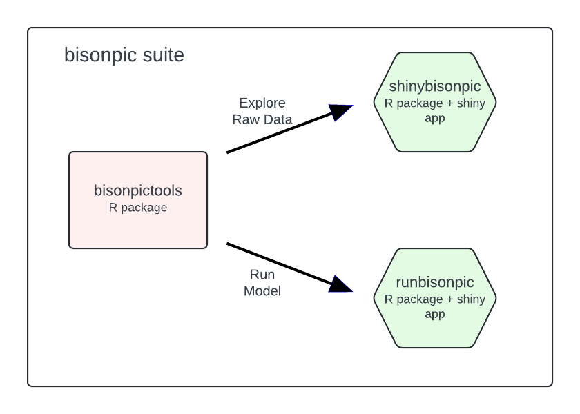

<!-- Copyright 2023 Province of Alberta -->

<!-- Licensed under the Apache License, Version 2.0 (the "License"); -->
<!-- you may not use this file except in compliance with the License. -->
<!-- You may obtain a copy of the License at -->

<!-- http://www.apache.org/licenses/LICENSE-2.0 -->

<!-- Unless required by applicable law or agreed to in writing, software -->
<!-- distributed under the License is distributed on an "AS IS" BASIS, -->
<!-- WITHOUT WARRANTIES OR CONDITIONS OF ANY KIND, either express or implied. -->
<!-- See the License for the specific language governing permissions and -->
<!-- limitations under the License. -->

```{r, include = FALSE}
knitr::opts_chunk$set(
  collapse = TRUE,
  comment = "#>"
)
```

```{r setup, echo = FALSE}
library(bisonpictools)
```

`bisonpictools` is an R package to facilitate the visualization and analysis of camera trap data from the Ronald Wood Bison herd.
The package includes functions to check the correct formatting of data, visualize the data, manipulate and analyse the data using a complex custom-built Bayesian model, and generate and plot predictions of abundances, survival and fecundity rates, and population ratios.

In order to use `bisonpictools`, you need to install R (see below).

## Installation

In order to install R [@r_core_team_r_2023] the appropriate binary for the user's operating system should be downloaded from [CRAN](https://cran.r-project.org/) and then installed.
RStudio is a helpful user interface for R, and can be downloaded [here](https://posit.co/download/rstudio-desktop/).

To install the latest development version of `bisonpictools`, execute the following code in the RStudio console.

```{r, eval = FALSE}
install.packages("pak")
pak::pak("poissonconsulting/bisonpictools")
```

## bisonpic Suite

`bisonpictools` is part of the **bisonpic** suite of tools. 
Other packages in this suite include:

- [`shinybisonpic`](https://github.com/poissonconsulting/shinybisonpic)
- [`runbisonpic`](https://github.com/poissonconsulting/runbisonpic)

`bisonpictools` provides the underlying visualization and analysis functionality; `shinybisonpic` is a web-based Shiny app to aid data visualization and exploration, and `runbisonpic` is a local-based Shiny app to analyze a complex custom Bayesian model to estimate total and sex-age class abundances, fecundity and survival rates, and various ratios of sex-age classes.

```{r, echo = FALSE, out.width = '70%'}

```

## Getting Help

To get additional information on a particular function just type `?` followed by the name of the function in the R console. For example ?bpt_analyse brings up the R documentation for the `bisonpictools` analysis function.

For more information on using R the reader is referred to [R for Data Science](https://r4ds.had.co.nz/) [@wickham_r_2016].

If you discover a bug in `bisonpictools` please file an issue with a reprex (reproducible example) at https://github.com/poissonconsulting/bisonpictools/issues.

## Data 

In both the `shinybisonpic` and `runbisonpic` Shiny apps, the user can download a templated excel spreadsheet to populate the following data tables:

- `event_data` contains the camera trap event data, including the date and time of each event, location of the camera trap, and the number of individuals in each class
- `location_data` contains the coordinates of the camera traps
- `census_data` contains census estimates of the population from aerial surveys, and the date of the surveys
- `proportion_calf_data` contains estimates of the proportion of calves in the population from aerial surveys, and the date of the surveys

The template contains information about what is required in each column.
When uploaded, the data is checked to ensure correct formatting.
We suggest downloading the template from one of the Shiny apps and populating it, to ensure the tables have the correct sheet and column names, even if the user wishes to use the RStudio console to run the data visualization and/or analysis steps.

## Data Visualization

### `shinybisonpic`

Use the [`shinybisonpic` Shiny app](https://poissonconsulting.shinyapps.io/shinybisonpic/) to explore the locations of camera traps and the the ratios of different classes of wood bison in camera trap observations.
Refer to the [user guide](https://poissonconsulting.github.io/bisonpictools/user-guide.html) for more information on how to use the `shinybisonpic` app.

\n

If desired, functions from `bisonpictools` can be run in the RStudio console.
The `bpt_plot_ratios()` function plots the ratios of various sex-age classes over time.
The user needs to provide the event and location data, as well as vectors of classes to form the numerator and denominator of the ratio.
Data checks are completed before the analysis is run to ensure they are in the correct format. 
Please note that the ratio plotted by `bpt_plot_ratios()` is `numerator:(denominator + numerator)` to avoid plotting infinite values.
In the plot, each point represents an event. 
The size of the point represents the total group size, and the colour of the point represents the value of the ratio.

For example, the adult cow:(bull + cow) ratio plotted over all years and locations from example data:
``` {r, fig.dim = c(8, 6)}
library(bisonpictools)
bpt_plot_ratios(
  bpt_event_data,
  bpt_location_data,
  numerator = "fa",
  denominator = "ma"
)
```

It is also possible to subset the data to include one or more camera trap locations and/or study years:

``` {r, fig.dim = c(8, 6)}
bpt_plot_ratios(
  bpt_event_data,
  bpt_location_data,
  numerator = "fa",
  denominator = "ma",
  study_years = "2019-2020",
  locations = c("LOCID1", "LOCID2")
)
```

Several age/sex classes can be combined to plot ratios of interest.
For example, this plots the calf:(cow + calf) ratio:

```{r, fig.dim = c(8, 6)}
bpt_plot_ratios(
  bpt_event_data,
  bpt_location_data,
  numerator = c("f0", "m0", "u0"),
  denominator = c("fa")
)
```

## Data Analysis

### `runbisonpic`

Launch the local data analysis app by running the following lines of code in the RStudio console.

```{r, eval = FALSE}
# Install `runbisonpic`
pak::pak("poissonconsulting/runbisonpic")
# Launch local app
runbisonpic::launch_runbisonpic()
```

Proceed by uploading the data into the app.
See the [user guide](https://poissonconsulting.github.io/bisonpictools/user-guide.html) for more guidance on how to use the `runbisonpic` app.

### Using the RStudio Console

If desired, the steps that occur behind the scenes in the `runbisonpic` app can be executed in an R script in RStudio, by following these steps:

#### (1) Read in data from the populated excel template

```{r, eval = FALSE}
# Change `dir` to the file path of the populated excel template on your computer
dir <- "myfilepath.xlsx"
# Install readxl to read the excel spreadsheet into R
pak::pak("readxl")
# Read each sheet into R
location_data <- readxl::read_xlsx(dir, sheet = "location")
event_data <- readxl::read_xlsx(dir, sheet = "event")
census_data <- readxl::read_xlsx(dir, sheet = "census")
proportion_calf_data <- readxl::read_xlsx(dir, sheet = "proportion_calf")
```

#### (2) Run the analysis 

This uses the `bpt_analyse()` function.
Data checks are completed before the analysis is run to ensure they are in the correct format. 
Informative error messages will print to the console if the data do not follow the required format.
The following arguments control the number of MCMC chains, number of iterations, and the thinning rate of the model:

- `analysis_mode` controls the number of iterations and chains in the model run:
  - `"debug"` is used for printing out the errors if the model does not sample (10 iterations from 2 chains),
  - `"quick"` is used for running through a quick run of the model for demonstration purposes (10 iterations from 2 chains),
  - `"report"` is the default and is used for the full analysis (500 iterations from 3 chains).

- `nthin` controls the thinning of the MCMC samples:
  - `nthin = 1L` saves every sample; use this for `"debug"` and `"quick"` modes,
  - `nthin = 10L` saves every $10^{th}$ sample, and is the detault; use this for `"report"` mode,
  - increase `nthin` by 5 if the model does not converge in "report" mode.
  
It is recommended to:

1. Run the model in `analysis_mode = "quick"` mode with a thinning rate of `nthin = 1L` to ensure the model samples correctly.
2. If there were no errors in step 1, proceed by running the model in `analysis_mode = "report"` with a thinning rate of `nthin = 10L`, to achieve convergence. 
Ensure the table output by the model has `TRUE` in the "converged" column.
If the model did not converge, increase `nthin` by 5, and re-run the model.
3. If there were errors in step 1, proceed instead by running the model in `analysis_mode = "debug"` with a thinning rate of `nthin = 1L` to print informative error messages.
  

```{r, eval = FALSE}
# Start by running once on "quick" mode, with a thinning rate of 1
analysis <- bpt_analyse(
  event_data = event_data,
  location_data = location_data,
  census_data = census_data,
  proportion_calf_data = proportion_calf_data,
  nthin = 1L,
  analysis_mode = "quick"
)

# If no errors appear, run the model on "report" mode, with a thinning rate of 10
analysis <- bpt_analyse(
  event_data = event_data,
  location_data = location_data,
  census_data = census_data,
  proportion_calf_data = proportion_calf_data,
  nthin = 10L,
  analysis_mode = "report"
)

# If errors do appear, run the model on "debug" mode, which will provide
# informative error messages
analysis <- bpt_analyse(
  event_data = event_data,
  location_data = location_data,
  census_data = census_data,
  proportion_calf_data = proportion_calf_data,
  nthin = 1L,
  analysis_mode = "report"
)
```

#### (3) Check that the model converged

In `"quick"` or `"debug"` mode, convergence is not expected.
In `"report"` mode, convergence is expected. 
See the `converged` column in the table printed after `bpt_analyse()` is run to assess whether or not the analysis converged.
If it says `TRUE`, the model converged. 
If it says `FALSE`, the model did not converge.

This is an example of a model run in "quick" mode that did not converge (i.e., the "converged" column reads `FALSE`).

```{r, echo = FALSE}
glance <- readRDS(
  file = system.file(package = "bisonpictools", "test-objects/glance.RDS")
)
print(glance)
```


```{r, echo = FALSE}
analysis <- readRDS(
  file = system.file(package = "bisonpictools", "test-objects/analysis.RDS")
)
```

#### (4) Coefficient table

Use the `bpt_coefficient_table()` function to print out the estimated parameters from the model run.

```{r}
coef <- bpt_coefficient_table(analysis)
print(coef)
```

#### (5) Save the analysis object

Ensure that the analysis object is saved once the model finishes running.
The `bpt_save_analysis()` function saves the analysis to the desired file path.

```{r, eval = FALSE}
# Save the analysis object.
# Change the file path to the desired directory (does not require a file extension)
bpt_save_analysis(analysis, file = "file_path/analysis")
```

To load the analysis object back into R, use the complimentary function, `bpt_load_analysis()`, using the same file path it was saved to above.

```{r, eval = FALSE}
# Load analysis object if not still in the environment, using the same file path
# it was saved to in step (4) above.
analysis <- bpt_load_analysis("file_path/analysis")
```

#### (6) Make predictions 

Predictions of the stage-wise and total abundances, survival and fecundity rates, and select ratios are derived from the posterior distributions of the estimated parameters.
Use the functions with the `bpt_predict` prefix to generate the predictions.

```{r}
# Predict total abundance
bpt_predict_abundance_total(analysis)
```

```{r}
# Predicts abundance by class:
bpt_predict_abundance_class(analysis)
```

```{r}
# Predicts survival rates by class:
bpt_predict_survival(analysis)
```

```{r}
# Predicts fecundity rate and proportion of reproductive cows:
bpt_predict_fecundity(analysis)
```

```{r}
# Predicts population ratios:
bpt_predict_ratios(analysis)
```

#### (7) Plot Predictions

The `bpt_plot_predictions()` function can be used to visualize the predictions.

```{r, fig.dim = c(7, 6)}
# Plot predicted abundances by class
bpt_plot_predictions(analysis, prediction = "abundance-class")
```

```{r, fig.dim = c(7, 6)}
# Plot total abundance
bpt_plot_predictions(analysis, prediction = "abundance-total")
```

```{r, fig.dim = c(7, 6)}
# Plot survival rates
bpt_plot_predictions(analysis, prediction = "survival")
```

```{r, fig.dim = c(7, 6)}
# Plot fecundity rates
bpt_plot_predictions(analysis, prediction = "fecundity")
```

```{r, fig.dim = c(7, 6)}
# Plot ratios
bpt_plot_predictions(analysis, prediction = "ratios")
```

## Going beyond `bisonpictools`

The analysis object is a list that contains the model code, mcmc samples (class `mcmcr`), and other meta-data used to fit the model.
The user can interact directly with the mcmc samples using packages such as [`mcmcr`](https://github.com/poissonconsulting/mcmcr), [`mcmcderive`](https://github.com/poissonconsulting/mcmcderive) to derive other quantities of interest.

## References

<div id="refs"></div>

```{r, results = "asis", echo = FALSE}
cat(bpt_licensing_md())
```
